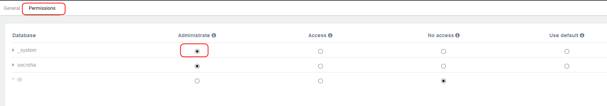

# Datenbank

Momentan nutzen wir die Datenbank ArangoDB als Datenspeicher zur Speicherung der Daten im JSON-Format. 
Natürlich ist es später möglich, die Datenbank gegen ein Relationales Datenbank-Mangement-System (RDBMS) 
auszutauschen.

Nach erfolgreicher Installation der Datenbank können wir uns am Web-Interface der Datenbank anmelden. 
Das Webinterface der Datenbank wird standardmäßig über den Port: 8529 auf dem loclhost geöffnet.

```bash
   http://localhost:8529
```

[Link nach localhost:8529](http://localhost:8529)


Im Anschluss daran ist es notwendig einen eigenen Benutzer für das neue Projekt zu erstellen.
Dabei ist zu beachten, dass der Benutzer im Anschluss "Managment Rechte" erhält. 




Nun könnt Ihr eine Datenbank anlegen.

In der Datenbank müssen wir anschließend drei Collections anlegen

 - users
 - files
 - documents


Die Verbindungsparameter müssen anschließend alle in die etc/components.yaml eingetragen werden.

``` bash
arango:
  user: root
  password: siguv
  database: docmanager
  url: http://127.0.0.1:8529
```
