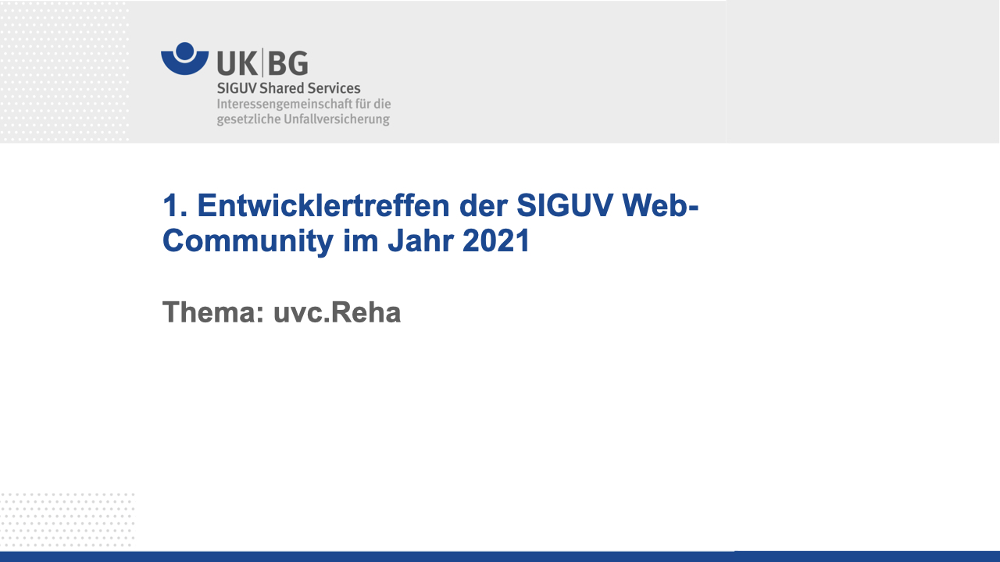
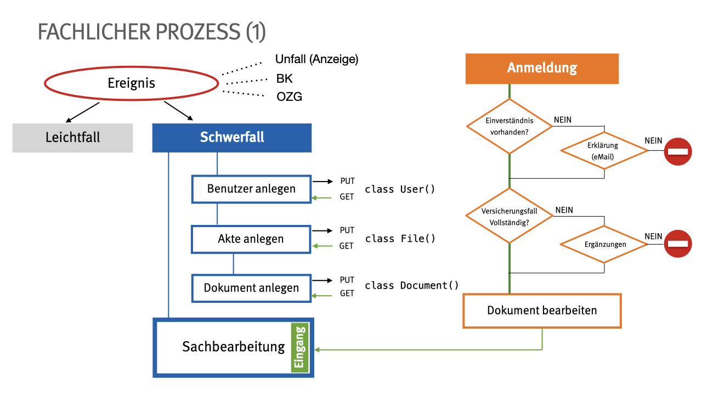
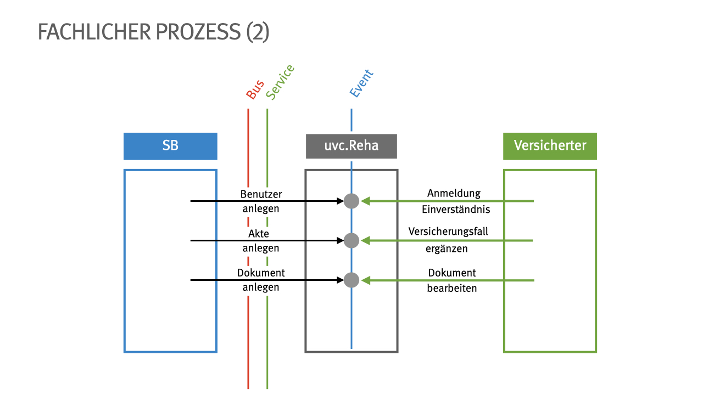
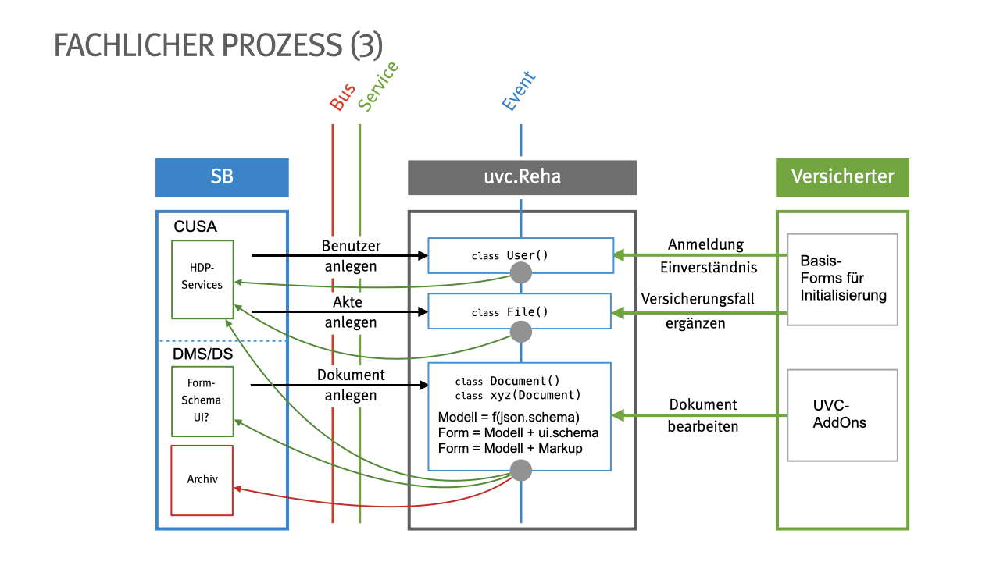
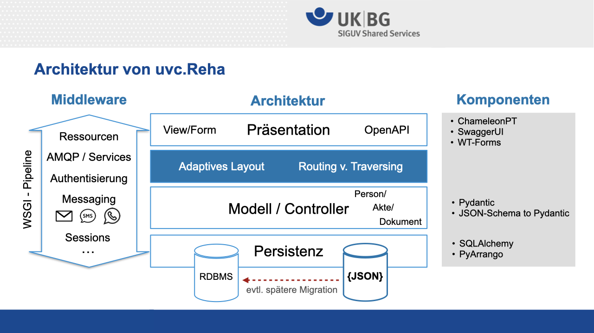

## UVCReha

# Dokumentation

Übersicht

UVC-Reha ist ein Framework um die elektronische Kommunitkation
mit Versicherten zu ermöglichen. In UVC-Reha wurden die Anforderungen 
die aus Unfallkassen und Berufsgenossenschften gebündelt und in
einfache Abstraktionen gegossen. Eine detailierte Zusammenfassung
kann in folgenden Dokument angesehen werden.

# Ablauf

